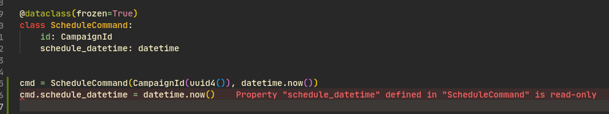

# Bussiness rules

1. As a user I want to create my campaigns with: name, subject, body and sender
2. As a user I want to schedule my campaigns to be sent out at a specified date
3. As a user I want to know the status of my campaign
    * Our product owner says that the status should be the following ones
        * draft: When the user creates his campaign and do some updates
        * draft -> scheduled: When the user specifiy a date to be sent
        * draft -> sending: When the user tries to send immediately the campaign
        * scheduled -> sending: When it is time to send the campaign
        * sending -> sent: When the campaign is completely sent to all of its recipients
4. As a user I want to create contact lists
5. As a user I want to specify contact lists for a campaign
6. As a user I want to know the delivery status of my recipients
7. Users will have a daily send limit

# DDD
## Domain modeling
### Entity and Value objects
Entities are objects that needs to be uniquely recognizable among the application by its identification. 
While value objects are objects that we don't care about
their identity instead we care about their properties.

An entity can be any python class with id attribute and value objects can be represented by python classes too but you can make it better using `@dataclass(frozen=True)` decorator which add to your class the inmutability property and also add a default constructor with all attributes.

### Aggregate
It is a consistency boundary where 1 or more objects (entities and value objects) collaborate to resolve some business rules. Aggregates should be built thinking in:
1. Transactions: An aggregate should be saved always as a unit
2. Invariants: Aggregates enforce business rules so the application always end in a consistent state after some operation. i.e "A scheduled campaign should have a time to send"
### Aggregate root
The aggregate root is the "gateway" of a specific aggregate, this object is the entrypoint for clients to perform business rules. Some rules that an aggregate root should follow:
1. The communication between aggregates should be between aggregate roots
2. There should be one repository per aggregate
3. When a change to any object within the AGGREGATE boundary is committed, all invariants of the whole AGGREGATE must be satisfied.
### Services
Better described by Eric Evans
```
When a significant process or transformation in the domain is not a natural responsibility of an ENTITY or VALUE OBJECT, 
add an operation to the model as standalone interface declared as a SERVICE.
Define the interface in terms of the language of the model and make sure the operation name is part
of the UBIQUITOUS LANGUAGE. Make the SERVICE stateless.
Eric evans. DDD
```
### Repositories
Repositories are an abstraction to handle persistence of data. They are responsible of retreiving and storing
our domain objects into a durable database. Because they are an infrastructure concern they should not be coupled
to our domain objects, only the services are able to talk with them.
Following the Dependency Inversion principle we should create an "interface" that the repository should support
This is in order to make testing easier and also to decouple our services from infrastructure details.
For python we can achieve this by using:
1. [Protocols](https://peps.python.org/pep-0544/): This feature is for python versions >3.8 and it enables static duck typing which fits very good for our needs. "Implementers" do not have to extend from this class they just have to fullfil this contract.
```python
class CampaignRepo(Protocol):
    def store(self, campaign: Campaign) -> None:
        raise NotImplementedError

    def find(self, id: CampaignId) -> Optional[Campaign]:
        raise NotImplementedError

    def update(self, campaign: Campaign) -> None:
        raise NotImplementedError
```
2. Use default arguments: Instead of using Dependency Injection containers we can use default arguments to have the same effect. If you are a purist hexagonal arch dev you may think that the service has a clear coupling on the infrastructure, this is true but in my opinion it's not a big deal since it's super explicit (you don't have to go to a config file or see what the DI container is doing) and also since it is an argument you still have the potential to mock the repository in testing time.
```python
def create_campaign(
    command: CreateCampaignCommand,
    campaign_repo: Optional[CampaignRepo] = campaign_mysql_repo,
) -> None:
    ...
```
